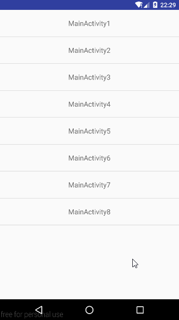

# MyPullToRefreshDemo
我自己实现的 Android 下拉刷新框架, 借鉴了 [chrisbanes/Android-PullToRefresh](https://github.com/chrisbanes/Android-PullToRefresh) 的一些思想和设计, 旨在更深刻地理解 Android 的下拉刷新机制以及 View体系的相关知识点(绘制原理, 事件分发, scroll, Scroller). 该框架提供了默认的刷新头 header View 和要刷新的 content View 的实现, 调用者也可以自定义该刷新头并替换掉默认的实现, 使用时需要设置具体的 content View.  总体来说, 需要刷新的 content View 分为两种:

1. 内容可滚动的 View. 例如: `AbsListView` (`ListView`, `GridView`), `ScrollView`, 竖直方向的 `RecyclerView` 等.
2. 内容不可滚动的 View. 例如: `TextView` 等.

其中, 关于第一种, 目前的代码只对 `AbsListView` 的下拉做了适配, 并且只对 `ListView` 做了相应测试, 还需进一步完善.    

该demo包含多个命名以 MainActivity 开头, 以数字结尾的 java文件, 这些文件记录了该框架一步步的实现过程.

